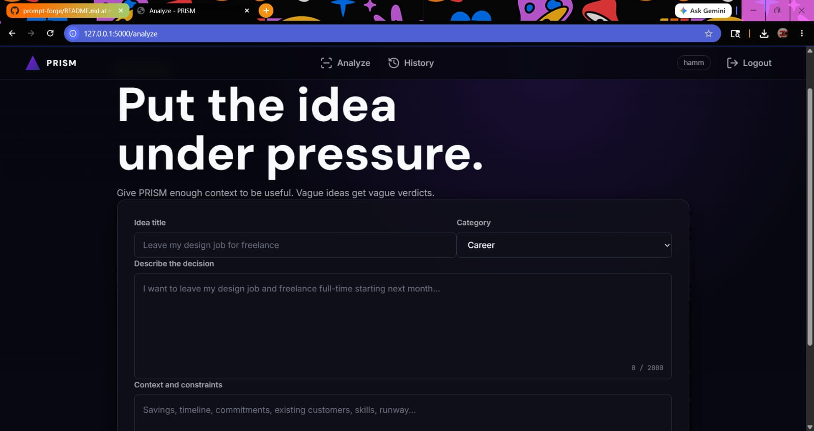
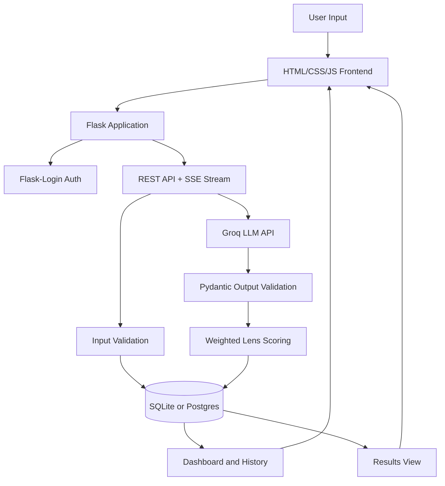

# PRISM - AI Decision Intelligence

PRISM is a Flask-based decision intelligence platform that helps founders, students, and teams evaluate ideas with more structure and less guesswork. It turns a raw idea into a five-lens analysis, highlights blind spots, and saves the result so decisions can be compared over time.

[](https://www.python.org/)
[](https://flask.palletsprojects.com/)
[](https://www.sqlite.org/)
[](https://groq.com/)
[](LICENSE)


Live demo: [prism-sepia-chi.vercel.app](https://prism-sepia-chi.vercel.app)

## Why PRISM Exists

Most early decisions are judged with a mix of optimism, fear, and incomplete information. That is especially true for startup ideas, career moves, creative projects, and personal bets.

PRISM gives those decisions a repeatable review process. Instead of asking an AI model for vague encouragement, the app forces every idea through the same lenses: viability, risk, timing, differentiation, and personal fit. The result is not a final answer. It is a sharper starting point for deciding what to validate next.

## Key Features

- Five-lens idea analysis covering viability, risk, timing, differentiation, and personal fit
- Weighted composite scoring calculated server-side for consistent results
- Groq-powered LLM analysis with server-sent event streaming
- Pydantic validation to reject malformed model output before it is saved
- Authenticated user accounts with Flask-Login and bcrypt password hashing
- Persistent idea and analysis history through SQLAlchemy models
- SQLite for local development with Postgres-ready configuration for deployment
- Rate-limited API endpoints for idea creation and analysis requests
- Tested auth, API, model, config, service, and streaming behavior with pytest

## Screenshots

Current product captures live in `assets/screenshots/`. Use the checklist in [docs/screenshot-checklist.md](docs/screenshot-checklist.md) before replacing them with final production screenshots.

| Landing | Analysis | Results |
| --- | --- | --- |
|  |  |  |

Planned captures: dashboard history, streaming state, and final deployment screenshots.

## Architecture



The application follows a standard Flask application factory pattern. Routes are grouped by responsibility, SQLAlchemy owns persistence, Pydantic validates structured model responses, and the frontend listens to a streaming endpoint so users can see progress while an analysis is generated.

## Example Analysis

**Input Idea**

Build a fixed-scope micro-SaaS studio for non-technical founders. The service would ship MVPs in three weeks for a fixed price. The founder has a small team, three inbound leads, and roughly $10,000 in runway.

| Metric | Result |
| --- | --- |
| Overall Score | 72/100 |
| Confidence Score | 76/100 - medium-high confidence because the idea includes clear constraints, target users, and early demand signals |
| Recommendation | Proceed with a narrow pilot before scaling the offer |
| Final Verdict | Promising, but only if scope control and client qualification are treated as core product features, not operational afterthoughts. |

| Lens | Score | Read |
| --- | ---: | --- |
| Viability | 82 | Real customer pain and a clear service path make the first version achievable. |
| Risk | 58 | Scope creep, delivery pressure, and weak qualification could quickly destroy margins. |
| Timing | 74 | Demand for fast MVP validation is strong, but buyers are increasingly cautious with spend. |
| Differentiation | 67 | Fixed scope helps, but the offer needs a sharper niche than "MVPs for founders." |
| Personal Fit | 79 | A small technical team with inbound leads is a credible starting position. |

**Blind Spots**

- A fixed timeline does not matter if project intake fails to control complexity.
- Three inbound leads are useful, but they are not yet proof of repeatable acquisition.
- The productized-service model needs strong templates, boundaries, and post-launch support rules.

## Technology Stack

| Layer | Tools |
| --- | --- |
| Backend | Flask, Flask blueprints, Flask application factory |
| ORM and Database | SQLAlchemy, SQLite locally, Postgres-ready `DATABASE_URL` |
| Authentication | Flask-Login, bcrypt |
| Validation | Pydantic, custom request validators |
| AI Integration | Groq API, structured JSON responses |
| Frontend | HTML, CSS, JavaScript, server-rendered templates |
| Testing | pytest, Flask test client |
| Deployment | Vercel serverless wrapper, WSGI-compatible Flask app |

## Project Structure

```text
.
|-- app/
|   |-- models/              # User, Idea, Analysis, and LensResult models
|   |-- routes/              # Main pages, auth, API, and streaming analysis routes
|   |-- services/            # Groq prompt construction and analysis persistence
|   |-- utils/               # Request validation and API response helpers
|   |-- __init__.py          # Flask application factory
|   |-- config.py            # Environment-based configuration
|   `-- extensions.py        # SQLAlchemy, LoginManager, CSRF, Migrate, Limiter
|-- api/
|   `-- index.py             # Vercel production entry point
|-- docs/                    # Demo, screenshot, prompt, and portfolio docs
|-- static/                  # CSS and JavaScript assets
|-- templates/               # Jinja templates for app pages
|-- tests/                   # pytest coverage for app behavior
|-- run.py                   # Local Flask CLI and development entry point
|-- requirements.txt         # Python dependencies
|-- vercel.json              # Vercel routing/build config
`-- LICENSE                  # MIT license
```

## Installation

Clone the repository and create a virtual environment:

```bash
git clone https://github.com/Hamzzzaaa0011/prism-forge.git
cd prism-forge
python -m venv .venv
```

Activate the environment:

```powershell
# Windows PowerShell
.\.venv\Scripts\Activate.ps1
```

```bash
# macOS/Linux
source .venv/bin/activate
```

Install dependencies:

```bash
pip install -r requirements.txt
```

Dependencies are pinned for reproducible installs. Update versions intentionally and run the full test suite before committing dependency changes.

Create your local environment file:

```bash
cp .env.example .env
```

On Windows PowerShell:

```powershell
Copy-Item .env.example .env
```

## Environment Variables

| Variable | Required | Description |
| --- | --- | --- |
| `FLASK_APP` | Local | Flask entry point. Use `run.py`. |
| `FLASK_ENV` | Local | Use `development` locally and `production` in deployed environments. |
| `SECRET_KEY` | Yes | Secret used for Flask sessions and CSRF protection. Use a strong random value outside development. |
| `DATABASE_URL` | Yes | SQLAlchemy database URL. Defaults well to SQLite locally and supports Postgres in production. |
| `GROQ_API_KEY` | Yes for live analysis | Groq API key used for LLM inference. Tests do not require a real key. |
| `PRISM_MODEL` | Optional | Groq model name. Defaults to `llama-3.3-70b-versatile`. |
| `RATELIMIT_STORAGE_URI` | Optional | Flask-Limiter storage backend. Defaults to `memory://`. |
| `PRISM_INSTANCE_PATH` | Optional | Custom Flask instance directory, useful in serverless environments. |
| `PRISM_AUTO_CREATE_DB` | Optional | Set to `true` for simple demo deployments that should create tables on startup. |

## Running Locally

Use `run.py` for local development commands. It is a thin wrapper around the Flask application factory in `app/__init__.py`; the factory remains the source of truth for app creation.

Initialize the database:

```bash
flask --app run.py init-db
```

Start the development server:

```bash
flask --app run.py --debug run
```

Open the app at:

```text
http://127.0.0.1:5000
```

Basic flow:

1. Register a local account.
2. Submit an idea from `/analyze`.
3. Start analysis and watch the streamed result.
4. Review saved analyses from `/dashboard`.

## Testing

Run the full test suite:

```bash
pytest
```

Run a focused streaming test:

```bash
pytest tests/test_stream.py -q
```

The test suite uses Flask's test client and mocked AI responses where needed, so a real `GROQ_API_KEY` is not required for automated tests.

GitHub Actions also runs `pytest` on pushes to `main`, pushes to `codex/**` branches, and pull requests targeting `main`.

## Deployment

### Vercel

This repository includes `vercel.json` and `api/index.py` for Vercel's Python runtime.

Set these environment variables in Vercel:

```text
SECRET_KEY=<strong-random-secret>
DATABASE_URL=<postgres-url-or-demo-sqlite-url>
GROQ_API_KEY=<groq-api-key>
PRISM_MODEL=llama-3.3-70b-versatile
PRISM_INSTANCE_PATH=/tmp/instance
PRISM_AUTO_CREATE_DB=true
RATELIMIT_STORAGE_URI=memory://
```

For portfolio demos, SQLite can work as a temporary store. For real users, use managed Postgres because serverless filesystems are ephemeral.

### Render, Railway, Fly.io, or a VM

Use a managed Postgres database, set the same environment variables, and run the app through a production WSGI server:

```bash
gunicorn "app:create_app('production')"
```

Before accepting traffic, create the database schema with:

```bash
flask --app run.py init-db
```

## Roadmap

- Add a first-class confidence score field separate from the weighted composite score
- Add exportable PDF and CSV reports for saved analyses
- Add team workspaces and shared decision history
- Add configurable lens weights and reusable analysis templates
- Add database migrations for production schema changes
- Add linting, formatting, and type-checking jobs to CI
- Publish a `v0.1.0` release after the first cleaned-up portfolio version is merged

## Contributing

Contributions are welcome when they improve reliability, clarity, or product usefulness.

1. Fork the repository.
2. Create a focused branch.
3. Add or update tests for behavior changes.
4. Run `pytest`.
5. Open a pull request with a clear summary and screenshots for UI changes.

See [CONTRIBUTING.md](CONTRIBUTING.md) for more detail.

## License

PRISM is released under the [MIT License](LICENSE).

MIT is a good fit for this repository because it keeps the project easy to inspect, reuse, fork, and discuss in hiring or open-source contexts. It is permissive, widely understood, and avoids adding legal friction for people reviewing the code. As usual, the software is provided without warranty.

## Author

Built and maintained by **Malik Hamza**.

GitHub: [Hamzzzaaa0011](https://github.com/Hamzzzaaa0011)
Live project: [prism-sepia-chi.vercel.app](https://prism-sepia-chi.vercel.app)

This repository is designed to demonstrate full-stack Flask development, LLM integration, structured validation, product thinking, and professional open-source project presentation.
