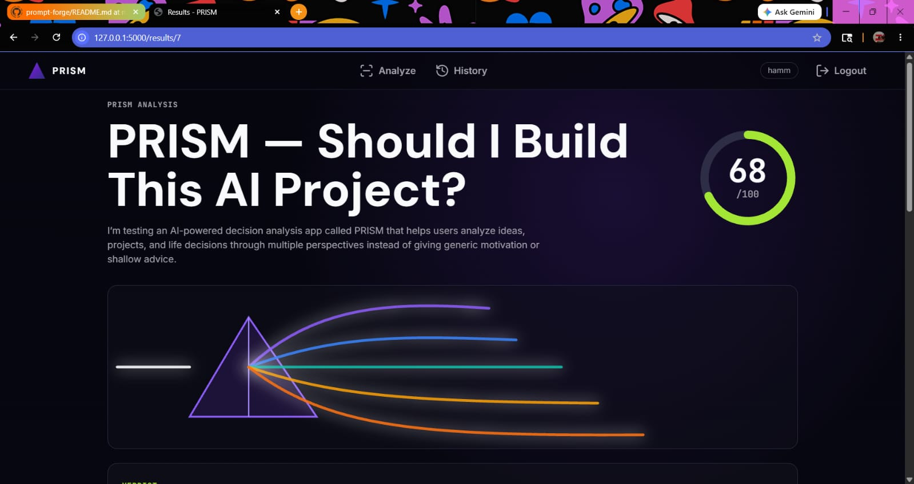
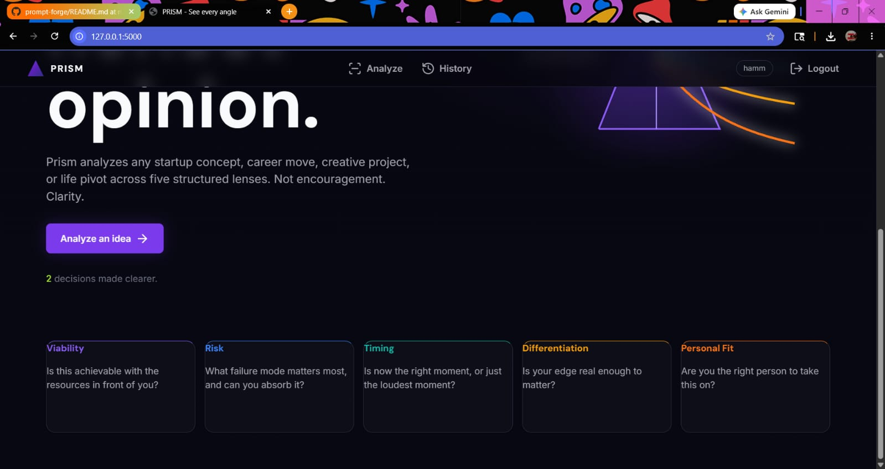

# PRISM — AI Decision Intelligence

PRISM is an AI-powered decision intelligence platform that helps founders, students, and teams evaluate ideas objectively. By analyzing an idea through multiple decision lenses, PRISM highlights strengths, risks, blind spots, and opportunities before a final recommendation is generated.

Live demo: LINK · Video walkthrough: LINK · Case study: LINK

## Overview

PRISM is a full-stack web application that analyzes ideas using a five-lens framework, returning a weighted composite score, lens-by-lens breakdowns, and blind-spot highlights. It focuses on actionable clarity and preserves analysis history for longitudinal comparison.

## Highlights

- Five-lens, weighted evaluation with transparent reasoning
- Blind-spot detection and concise recommendations
- Real-time streaming analysis (server-sent events) for visible progress
- Authenticated users with persistent history and comparison tools
- Strong schema validation of AI outputs for reliability

## Tech Stack

- Backend: Flask
- Database: SQLite (local) / Postgres-ready for production
- ORM & Auth: SQLAlchemy, Flask-Login
- Validation: Pydantic
- AI: Groq (LLM inference)
- Frontend: Vanilla HTML, CSS, JavaScript

## Screenshots

Add screenshots to `assets/screenshots/` and reference them here:

- Landing hero: assets/screenshots/01-whatsapp-1.jpeg
- Analyze form: assets/screenshots/02-whatsapp-2.jpeg
- Results: assets/screenshots/03-whatsapp-3.jpeg





## Quick Start (Local Development)

1. Clone the repo and enter the project directory:

```bash
git clone <repo-url>
cd "new project"
```

2. Create and activate a virtual environment (Windows example):

```powershell
python -m venv .venv
.\.venv\Scripts\Activate.ps1
```

3. Install dependencies:

```bash
pip install -r requirements.txt
```

4. Create a copy of the example environment file and set values:

```bash
copy .env.example .env
# Edit .env and set values like FLASK_ENV, DATABASE_URL, GROQ_API_KEY, SECRET_KEY
```

5. Initialize the database (if migrations are used):

```bash
flask db upgrade
```

6. Run the development server:

```bash
flask --app app --debug run
```

Open http://127.0.0.1:5000 in your browser.

## Environment Variables

At minimum you should set the following in `.env` or your environment:

- `FLASK_ENV` — `development` or `production`
- `DATABASE_URL` — e.g. `sqlite:///instance/app.db` or Postgres URL
- `SECRET_KEY` — Flask session secret
- `GROQ_API_KEY` — API key for the LLM provider

## Running Tests

Run the test suite with:

```bash
pytest
```

## Deployment Notes

- Render/Railway: recommended for straightforward server deployment. Use `gunicorn` and set environment variables in the service dashboard.
- Vercel: requires a serverless wrapper for Flask — for minimal effort prefer Render or Railway.

Example production start:

```bash
pip install -r requirements.txt
gunicorn "app:create_app('production')"
```

## Contributing

We welcome contributions. Please follow these guidelines:

- Open an issue to discuss larger features or breaking changes.
- Keep PRs small and focused; include tests for new behavior.
- Run tests locally before submitting a PR.

## Roadmap

- Exportable PDF/CSV reports
- Team and workspace collaboration features
- Advanced model presets and templates

## License

This repository does not yet include a license. Add a `LICENSE` file (e.g., MIT) to clarify usage terms.

## Maintainers & Contact

- Malik Hamza — maintainer
- For questions or demo requests:Hamzamalik8327@gmail.com
- Portfolio: https://prism-sepia-chi.vercel.app

---

